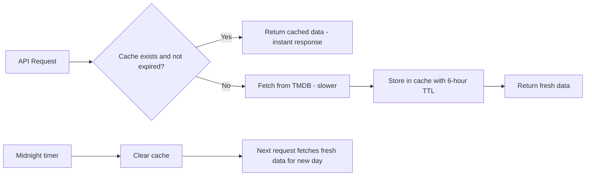

# Dynamic Backend Architecture Plan

## Overview

Upgrade the static "Today's Releases" website to a dynamic system that fetches **real movie and series release data** from APIs, specifically focused on Indian content (theatrical + OTT) plus major international releases.

---

## API Source: TMDB (The Movie Database)

**Why TMDB?**
- Free API tier with generous limits (50 requests/second)
- Comprehensive Indian content coverage (Hindi, Tamil, Telugu, Malayalam, Kannada, Bengali, Marathi)
- Both **movies** AND **TV series** data
- Release dates including theatrical and digital/OTT
- **Watch/providers endpoint** — shows which OTT platform carries a title in India
- Well-documented, stable, widely used

**TMDB API Endpoints Used:**

| Endpoint | Purpose |
|----------|---------|
| `/movie/upcoming?region=IN&language=en-IN` | Upcoming movies in India |
| `/movie/upcoming?region=US&language=en-US` | Major international upcoming movies |
| `/tv/on_the_air?region=IN&language=en-IN` | TV series currently airing/new episodes in India |
| `/movie/{id}/release_dates` | Detailed release dates per country |
| `/movie/{id}/watch/providers` | OTT platforms for a movie in India |
| `/tv/{id}/watch/providers` | OTT platforms for a series in India |

---

## Architecture Diagram

```mermaid
flowchart TD
    A[User opens browser] --> B[Frontend requests /api/today-releases]
    B --> C[Express Backend Server]
    C --> D{Cache check}
    D -->|Cache hit| E[Return cached data]
    D -->|Cache miss| F[Fetch from TMDB API]
    F --> G[/movie/upcoming - region IN]
    F --> H[/movie/upcoming - region US - filter famous]
    F --> I[/tv/on_the_air - region IN]
    G --> J[Filter to todays date only]
    H --> J
    I --> J
    J --> K[Enrich with watch/providers data]
    K --> L[Format and cache response]
    L --> M[Return JSON to frontend]
    E --> M
    M --> N[Frontend renders cards - same shadcn UI]
    N --> O[Auto-refresh countdown in footer]
    O --> P[At midnight - page reloads - fetches fresh data]
```

---

## Tech Stack

| Layer | Technology | Reason |
|-------|-----------|--------|
| Backend | **Node.js + Express** | Lightweight, simple API proxy, serves static files too |
| API Source | **TMDB API v3** | Best free source for Indian + international movie/series data |
| Caching | **In-memory Map with TTL** | Simple, no external dependency, sufficient for single-server |
| Frontend | **Existing HTML/CSS/JS** | Keep the shadcn-inspired UI, just change data source |
| Config | **dotenv** | Store TMDB API key securely |

---

## Project Structure

```
mobis r/
├── server.js              # Express server - API routes + static file serving
├── .env                   # TMDB API key and config (NOT committed to git)
├── .env.example           # Template for .env (committed to git)
├── package.json           # Node.js dependencies
├── public/                # Static frontend files
│   ├── index.html         # Main page (modified to fetch from API)
│   ├── styles.css         # Same shadcn-inspired styles
│   └── app.js             # Modified: fetches from /api/today-releases
│   └── movies-data.js     # REMOVED - data now comes from API
├── lib/
│   ├── tmdb.js            # TMDB API client - handles all TMDB calls
│   ├── cache.js           # In-memory cache with TTL support
│   └── formatter.js       # Transforms TMDB data into our card format
├── plans/
│   └── architecture.md    # This file
└── .gitignore             # Ignore .env, node_modules
```

---

## Backend API Endpoints

### `GET /api/today-releases`

Returns all movies and series releasing today.

**Response format:**
```json
{
  "date": "2026-05-22",
  "theatrical": [
    {
      "id": 123,
      "title": "Movie Name",
      "type": "Movie",
      "releaseType": "Theatrical",
      "ottPlatform": null,
      "language": "Hindi",
      "genre": "Action, Drama",
      "cast": "Actor1, Actor2",
      "director": "Director Name",
      "creator": null,
      "description": "Brief plot summary",
      "isIndian": true,
      "fameLevel": "High",
      "posterUrl": "https://image.tmdb.org/t/p/w500/...",
      "rating": 7.5
    }
  ],
  "ott": [
    {
      "id": 456,
      "title": "Series Name",
      "type": "Series",
      "releaseType": "OTT",
      "ottPlatform": "Netflix",
      "language": "Tamil",
      "genre": "Thriller",
      "cast": "Actor1",
      "director": null,
      "creator": "Creator Name",
      "description": "Brief plot summary",
      "isIndian": true,
      "fameLevel": "Medium",
      "posterUrl": "https://image.tmdb.org/t/p/w500/...",
      "rating": 8.2
    }
  ]
}
```

### `GET /api/health`

Simple health check endpoint.

---

## TMDB Data Processing Pipeline

### Step 1: Fetch Upcoming Movies
- Call `/movie/upcoming` with `region=IN` for Indian releases
- Call `/movie/upcoming` with `region=US` for international (filter to only high-fame titles)
- Paginate through multiple pages if needed

### Step 2: Fetch TV Series
- Call `/tv/on_the_air` with `region=IN` for Indian series
- Filter to series that have new episodes airing today

### Step 3: Filter to Today
- For each movie, check `release_date` field against todays date
- For series, check episode air dates against todays date
- Only include titles with exact match to today

### Step 4: Enrich with Watch Providers
- For OTT titles, call `/movie/{id}/watch/providers` or `/tv/{id}/watch/providers`
- Extract Indian provider names from `results.IN.flatrate` array
- Map TMDB provider IDs to our platform names (Netflix, Amazon Prime, etc.)

### Step 5: Enrich with Release Type
- If a movie has a theatrical release date for today in India → `Theatrical`
- If a movie is available on an OTT platform today → `OTT`
- Some titles may be both (theatrical + simultaneous OTT release)

### Step 6: Format Output
- Transform TMDB data structure into our simplified card format
- Determine `language` from original_language field
- Determine `isIndian` based on original_language or production countries
- Determine `fameLevel` based on vote_count, popularity score
- Add poster URLs from TMDB image CDN

---

## Caching Strategy



- **Cache TTL**: 6 hours (release data doesnt change frequently within a day)
- **Cache key**: `today-releases-{YYYY-MM-DD}` (date-specific)
- **Midnight auto-clear**: Server also runs a midnight timer to clear cache so first request after midnight gets fresh data
- **In-memory storage**: Simple JavaScript Map with timestamp-based expiry check

---

## Frontend Changes

### What Changes
- `app.js` — Instead of reading from `movies-data.js`, it fetches from `GET /api/today-releases`
- `index.html` — Remove `<script src="movies-data.js">` tag
- `movies-data.js` — **Deleted** (no longer needed)

### What Stays the Same
- `styles.css` — Unchanged
- `index.html` structure — Unchanged (same sections, same DOM IDs)
- Card rendering logic — Same, just uses API response format
- Dark/light mode toggle — Unchanged
- Midnight auto-refresh — Unchanged (still reloads page, which re-fetches from API)
- Countdown timer — Unchanged

### New Frontend Features
- **Loading state**: Show a spinner/skeleton while API data is being fetched
- **Error state**: Show a friendly error message if API fails, with retry button
- **Poster images**: Cards now show movie/series poster thumbnails from TMDB

---

## Poster Images on Cards

Add poster thumbnails to each card:
- Small poster image (TMDB `w185` size = 185px wide) on the left side of the card
- Card layout becomes: **[Poster | Content]** horizontally
- Poster has rounded corners (8px), subtle border
- If no poster available, show a placeholder with film icon SVG

---

## Setup Instructions for User

1. Get a free TMDB API key:
   - Go to https://www.themoviedb.org/settings/api
   - Create account → Request API key (free tier)
   - Copy the API key (v3 auth)

2. Create `.env` file:
   ```
   TMDB_API_KEY=your_api_key_here
   PORT=3000
   CACHE_TTL_HOURS=6
   ```

3. Install and run:
   ```
   npm install
   npm start
   ```

4. Open browser: `http://localhost:3000`

---

## Implementation Todo List

1. Create `package.json` with dependencies (express, dotenv, node-fetch)
2. Create `.env.example` template
3. Create `.gitignore`
4. Create `lib/cache.js` — in-memory cache with TTL
5. Create `lib/tmdb.js` — TMDB API client
6. Create `lib/formatter.js` — data transformation
7. Create `server.js` — Express server with API routes and static file serving
8. Move frontend files into `public/` directory
9. Update `public/index.html` — remove movies-data.js script tag, add loading/error states
10. Update `public/app.js` — fetch from API, add loading spinner, error handling, poster images
11. Update `public/styles.css` — add poster image styling, loading skeleton, error state styling
12. Delete `movies-data.js` (no longer needed)
13. Test the full flow: start server → open browser → verify data loads